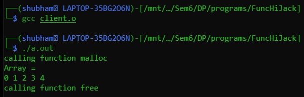
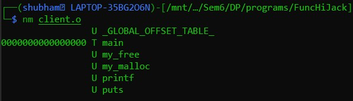
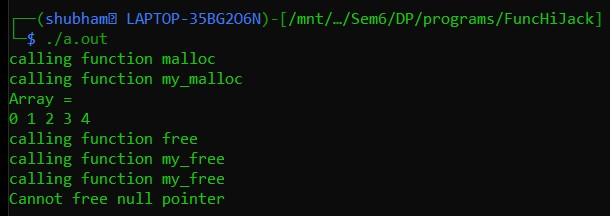

# Function-Hijacking
Implementation of hijacking ```malloc``` and ```free``` functions of stdlib.h in C. The concept of function hijacking is taught in the course Design Patterns by Prof. NSK, PES University.

## Idea
Replace the inbuilt ```malloc``` and ```free``` functions of ```stdlib.h``` without modifying the file (no write permissions) with my own implementations of the functions namely ```my_malloc``` and ```my_free  ``` during compile time.

## Actual Working
### Commands
```sh
gcc -c client.c
nm client.o
gcc client.o
./a.out
```
### Explaination
- ```gcc -c client.c``` creates an object file of client.c
- ```nm client.o``` lets the user see the functions defined in the object file. 
  
As seen the object file now references to ```malloc``` and ```free``` along with other functions.
- ```gcc client.o``` creates an executable file
- ```./a.out``` executes the program
- As noticed the default ```malloc``` and ```free``` functions are executed.


## Function Hacking
### Commands
```sh
gcc -c -Dmalloc=my_malloc -Dfree=my_free client.c
nm client.o
gcc -c fake_server.c
gcc client.o fake_server.o
./a.out
```
### Explaination
- ```gcc -c -Dmalloc=my_malloc -Dfree=my_free client.c``` creates an object file of client.c. The additional ```D``` flag replaces tokens specified during object creation time.
- ```nm client.o``` lets the user see the functions defined in the object file. 

As seen the object file now references to ```my_malloc``` and ```my_free``` without actually modifying the client.c
```gcc -c fake_server.c``` creates an object file for modified functions
- ```gcc client.o fake_server.o``` links both object files and creates an executable
- ```./a.out``` executes the program
- As demonstrated, the functions ```malloc``` and ```free``` are now hijacked by ```my_malloc``` and ```my_free``` without actually modifying the client.c.  


### Use case
- Can be used to test functions.
- Can be used to exploit programs (yet to do this).
- Function profiling.