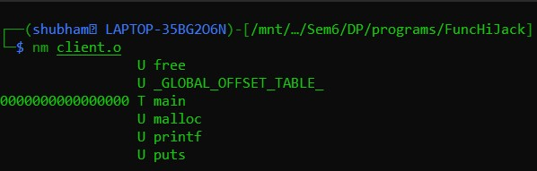

# Function-Hijacking
Implementation of hijacking ```malloc``` and ```free``` functions of stdlib.h in C

## Idea
Replace the inbuilt ```malloc``` and ```free``` functions of ```stdlib.h``` without modifying the file (no write permissions) with my own implementations of the functions namely ```my_malloc``` and ```my_free  ``` during compile time.

## Actual Working
### Commands
```bat
gcc -c client.c
nm client.o
gcc client.o
./a.out
```
### Explaination
- ```gcc -c client.c``` creates an object file of client.c
- ```nm client.o``` lets the user see the functions defined in the object file. 

As seen the object file now references to ```malloc``` and ```free``` along with other functions.
- ```gcc client.o``` creates an executable file
- ```./a.out``` executes the program
- As noticed the default ```malloc``` and ```free``` functions are executed.

